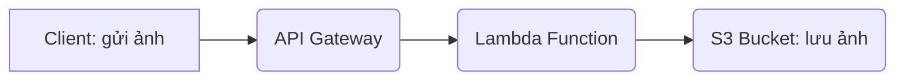

# 📦 Upload Image to S3 using API Gateway & AWS Lambda

## 👨‍🎓 Thông Tin Sinh Viên

- **Họ và Tên**: Vũ Yên Định  
- **MSSV**: 2180602169  
- **Email**: vuyendinh999@gmail.com  
- **GitHub**: [https://github.com/yendinh2003](https://github.com/yendinh2003)

---

## 📄 Executive Summary

Hệ thống này cho phép người dùng tải ảnh trực tiếp lên Amazon S3 bằng cách gửi yêu cầu HTTP POST đến API Gateway, qua một Lambda Function, giúp tiết kiệm chi phí, giảm độ phức tạp và đảm bảo mở rộng linh hoạt.

### Điểm nổi bật:
- Không cần backend server.
- Tự động scale với Lambda.
- Dễ dàng tích hợp với các frontend app.
- Giảm rủi ro bảo mật nhờ IAM Role kiểm soát quyền truy cập.

---

## 🧩 Kiến trúc hệ thống

### Các dịch vụ sử dụng:
- Amazon S3: lưu ảnh.
- AWS Lambda: xử lý logic tải ảnh.
- API Gateway: tạo endpoint public.
- IAM Role: giới hạn quyền truy cập.

---

## ⚙️ Triển khai kỹ thuật

### Các bước chính:
1. Tạo S3 bucket (có versioning, không public).
2. Tạo IAM Role chỉ cho phép Lambda ghi ảnh vào bucket.
3. Viết Lambda Function nhận ảnh từ body hoặc base64.
4. Tạo API Gateway tích hợp Lambda.
5. Bật CORS nếu frontend cần.

---

## ⏳ Lộ trình thực hiện

| Tuần | Công việc |
|------|-----------|
| 1 | Tạo hạ tầng (S3, IAM, Lambda) |
| 2 | Code và test Lambda |
| 3 | Tích hợp API Gateway |
| 4 | Kiểm thử và tối ưu hệ thống |

---

## 💰 Chi phí (trong Free Tier)

| Dịch vụ | Miễn phí | Chi phí vượt giới hạn |
|--------|----------|------------------------|
| Lambda | 1M req/tháng | $0.20 / 1M req |
| S3 | 5GB lưu trữ | $0.023/GB |
| API Gateway | 1M req/tháng | $3.50 / 1M req |

---

## ⚠️ Rủi ro & Giảm nhẹ

| Rủi ro | Mức độ | Cách xử lý |
|--------|--------|------------|
| Upload ảnh sai định dạng | Cao | Validate định dạng |
| Timeout Lambda | Trung bình | Tối ưu mã và cấu hình timeout |
| Public ảnh không mong muốn | Trung bình | Cấm public access mặc định |

---

## ✅ Kết quả kỳ vọng

- Hệ thống hoạt động 100% serverless.
- Người dùng có thể upload ảnh nhanh chóng (<3s).
- Có thể tích hợp trực tiếp vào React/Vue/Flutter app.
- Không mất phí nếu trong AWS Free Tier.

---

## 📚 Tài liệu tham khảo

- [AWS Lambda Docs](https://docs.aws.amazon.com/lambda)
- [API Gateway Docs](https://docs.aws.amazon.com/apigateway)
- [Amazon S3 Docs](https://docs.aws.amazon.com/s3)
